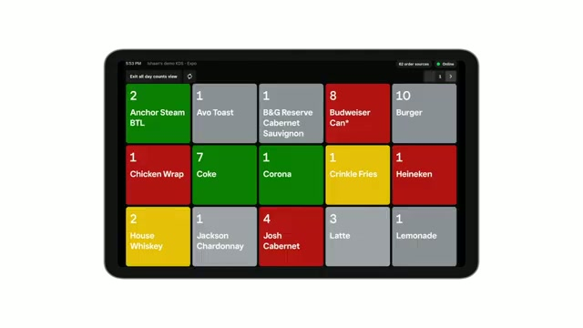
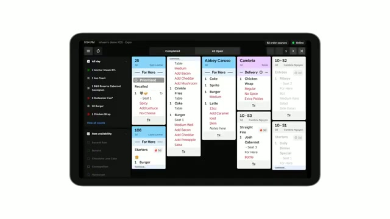
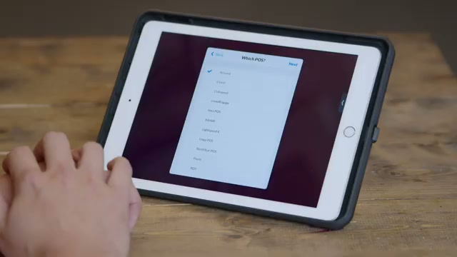
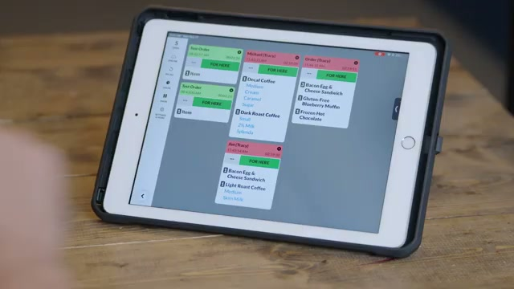

# Square KDS (Kitchen Display System) - Functional Specification

## Overview

Square KDS is a Kitchen Display System application that runs on Android tablets and iPads, allowing kitchen staff to view, track, and fulfill orders via digital tickets. It replaces traditional paper tickets and kitchen printers, connecting with Square Point of Sale, Square for Restaurants, Square Online, and third-party ordering/delivery platforms.

## Platform & Hardware

### Supported Devices
- Android tablets
- iPad tablets
- Square Register (as POS, not for running KDS app)

### Mounting Considerations
- Various mounting hardware supported (RAM mounts recommended)
- Any mount compatible with Android or iPad tablets works
- Placement in food preparation area is key consideration

### Pricing
- $20/month per device (Square Premium subscription)
- $30/month per device (Square Plus subscription)
- 30-day free trial available

---

## Display Types

### 1. Prep Station (Preparation)
- For kitchen staff who focus on preparing specific items of each order
- Granular view showing only items relevant to that station
- Less interaction with overall ticket required

### 2. Expo Station (Expeditor)
- For staff who bridge front-of-house and back-of-house operations
- Finalize orders for delivery to diners
- High-level visibility and control over all prep stations
- Can recall tickets to all stations if items need to be remade

---

## Main Interface

### Navigation Structure

#### Primary Tabs
1. **Open/Pending Orders** - Active orders waiting to be completed
2. **Completed Orders** - Orders that have been fulfilled

#### Sidebar Menu (Top Left Button)
- **All-Day Counts** - View as list or full screen
- **Item Availability** - Adjust item availability
- **Settings** - Access configuration

### All-Day Counts View

Displays a grid showing:
- Item names with quantities needed
- Color-coded status indicators:
  - **Green**: Normal/on track
  - **Yellow**: Warning (approaching time threshold)
  - **Red**: Late/urgent attention needed
  - **Gray**: Neutral/completed

---

## Ticket Display

### Ticket Layout

Each ticket displays:
- **Header** with customer name or order number
- **Order type indicator** (e.g., "For Here", "Delivery")
- **Line items** with modifiers
- **Time indicator** showing how long order has been open
- **Priority indicator** for prioritized tickets

### Ticket Interactions

#### Completing Items
- **Tap line item**: Complete individual line item
- **Tap ticket header**: Complete entire ticket

#### Prioritizing Orders
- Tap at bottom of ticket to prioritize ahead of other tickets
- Prioritized tickets display "Prioritized" label

#### Recalling Orders (Expo Station)
- From Completed tab, can recall ticket to:
  - All other expo stations
  - All stations (if item needs to be remade)

### Ticket Color Coding
Headers change color based on time thresholds:
- **Default**: Normal state
- **Yellow**: Warning threshold exceeded
- **Red**: Critical threshold exceeded

Colors can also be customized by dining option (dine-in, takeout, delivery, etc.)

---

## Settings Configuration

### General Settings
- Display name
- Display type (Prep/Expeditor)
- Clear tickets option
- Sign out of Square

### Routing Configuration
Configure which tickets appear on this KDS:

#### Point of Sale Selection
- Select specific POS terminals to receive tickets from

#### Online Orders
- Toggle to show/hide online orders
- Configure when online orders appear

#### Dining Options
- Customize which dining options show:
  - Dine-in
  - Takeout
  - Delivery
  - etc.

#### Items and Categories
- Toggle specific items/categories to show on this KDS
- Useful for station-specific displays (e.g., only grill items on grill station)

### Layout Options
Multiple ticket layout styles available:
- **Tiled** - Grid arrangement
- **Classic** - Traditional list view
- **Split** - Divided view for different categories

### Ticket Appearance

#### Header Styles
- Two different header designs available
- Customizable header colors based on dining option

#### Coursing Support
- If coursing enabled, option to show/hide held items

### Timers & Alerts
- Set yellow warning threshold (time in seconds/minutes)
- Set red alert threshold
- Headers automatically change color when thresholds exceeded

### Printers
- Configure printer stations
- Set up KDS as virtual printer in Square POS

---

## Integration Options

### Square Orders API (Cloud)
- Works over the internet
- Easier setup - single login required
- Limitations:
  - Doesn't support different order types
  - Requires internet connectivity
  - No offline capability

### Printer Emulation Mode (Local Network)
- Works locally across Square's local area connection
- Supports different order types
- Works offline
- Recommended for:
  - Environments with unreliable internet
  - Locations requiring order type differentiation

---

## Third-Party KDS Integration (Fresh KDS Example)

### Setup Process

#### 1. Hardware Setup
- Separate Android or iPad tablet required (cannot run on Square Register)
- Mount tablet in food preparation area

#### 2. App Installation
- Download from Google Play Store or Apple App Store
- Search for KDS app (e.g., "Fresh KDS")

#### 3. Account Setup
- Create account on KDS provider website
- Log in with email and password on tablet

#### 4. Location Configuration
- Select location (for multi-location accounts)
- Name the KDS screen (e.g., "Fry", "Grill", "Expo")

#### 5. POS Integration
- Select primary POS system (Square POS)
- Choose integration type:
  - Orders API (cloud-based)
  - Printer emulation (local network)

#### 6. View Settings
- Light or dark mode
- Ticket layout (Tiled, Classic, Split)
- Enable/disable takeout screen

### Square POS Configuration

#### Setting Up KDS as Printer Station
1. Go to Settings > Hardware > Printers
2. Create new printer station
3. Name the printer station (match KDS screen name)
4. Square discovers KDS devices on network
5. Select KDS device
6. Print test order to verify connection

#### Configuring Ticket Types
- Enable in-person ticket orders
- Enable online ticket orders
- Save printer station settings

### Order Flow
1. Order placed at Square POS
2. Order matches printer station criteria
3. Ticket appears instantly on KDS
4. Kitchen staff views items and modifiers
5. Tap ticket header to clear when complete

---

## Key Features Summary

### Order Management
- Real-time order display from multiple sources
- Order prioritization
- Item-level completion tracking
- Order recall for remakes

### Visibility & Tracking
- All-day counts for inventory awareness
- Time-based color alerts
- Station-specific filtering
- Multiple layout options

### Flexibility
- Works with in-person, online, and delivery orders
- Customizable by station role (prep vs expo)
- Multiple integration methods
- Support for various POS systems

### Kitchen Workflow
- Paperless ticket management
- Cross-station communication
- Coursing support
- Item availability management

---

## Sources

### Video Sources
1. **Square KDS Overview** - Official Square tutorial covering main features, settings, and configuration
2. **Square KDS Introduction** - Promotional overview of KDS capabilities
3. **Fresh KDS with Square Setup** - Third-party KDS integration tutorial by Fresh Technology

### Web Resources
- [Square KDS Official Page](https://squareup.com/us/en/point-of-sale/restaurants/kitchen-display-system)
- [Square KDS Setup Guide](https://squareup.com/help/us/en/article/7944-get-started-with-square-kds-android)
- [Square Community - Get Started with Square KDS](https://community.squareup.com/t5/Square-for-Restaurants/Video-Get-Started-with-Square-KDS/td-p/225951)
- [Fresh Technology KDS Guide](https://www.fresh.technology/blog/a-guide-to-kitchen-display-systems-for-square)
